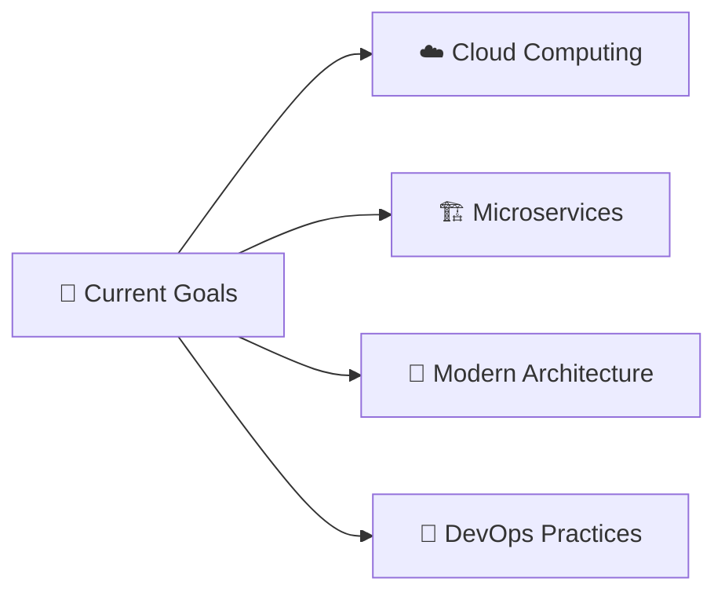

<!-- Typing SVG by DenverCoder1 -->

  

<h3 align="center">
  Welcome to Fawzy Shaker's GitHub! 🚀
</h3>

---

## 👨‍💻 About Me

  

 

🎓 **Education**  
&nbsp;&nbsp;&nbsp;&nbsp;Holding a Bachelor's degree in Computer Science from Kafrelsheikh University (Class of 2025)

💼 **Professional Journey**  
&nbsp;&nbsp;&nbsp;&nbsp;Aspiring Full Stack .NET Developer with hands-on experience in crafting modern web applications

🚀 **Technical Philosophy**  
&nbsp;&nbsp;&nbsp;&nbsp;Building secure, scalable, and maintainable software solutions using clean architecture principles

📚 **Continuous Growth**  
&nbsp;&nbsp;&nbsp;&nbsp;Currently deepening expertise in **Cloud Computing**, **Microservices**, and **Modern Software Architecture**

🌟 **Core Values**  
&nbsp;&nbsp;&nbsp;&nbsp;Team collaboration • Agile development • Delivering solutions that solve real-world problems

---

## 🛠️ Tech Stack & Tools

### 🔸 Backend Technologies

### 🔸 Frontend Technologies

### 🔸 Programming Languages

### 🔸 Development Tools

---

## 📄 Resume/CV

  
   
  <small><i>📧 Contact me for the latest version of my resume</i></small>

---

## 🌐 Let's Connect!

  

---

## 📊 GitHub Analytics

  
  
  
  
    
  
  
  

---

## 🎯 Current Focus

  

---

  
**💡 "Code is like humor. When you have to explain it, it's bad." - Cory House**

 

**Thanks for visiting! Let's build something amazing together! 🚀**

 

